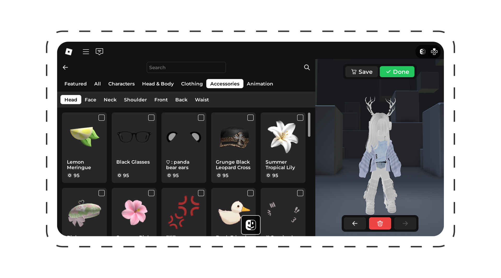

# Getting Started

## Installation 📦

### Roblox - Easy loader

1. Get the [easy loader](https://create.roblox.com/store/asset/122214542643927)
2. Insert it from the Toolbox
3. Place within `ReplicatedStorage`

### Roblox - Manual 

1. Download the [latest rbxm](https://github.com/loneka/avalog/releases/latest)
2. Insert into Roblox Studio
3. Call `Avalog:Start()` from the server and client

### Wally

:::warning

Wally support is currently dysfunctional due to dependency issues. Please use the [`rbxm`](https://github.com/loneka/avalog/releases/latest) instead.

:::

1. Copy details from [Wally](https://wally.run/package/imavafe/avalog)
2. Paste into your `wally.toml`
3. Run `wally install`
4. Call `Avalog:Start()` from the server and client
